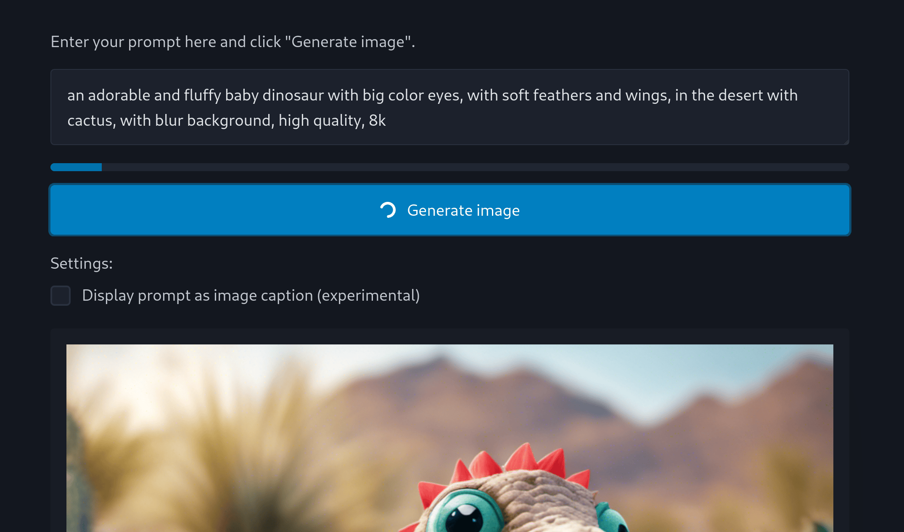

# SDXL CDK Go

> CDK Stack for Amazon Bedrock and Stability.ai Stable Diffusion XL 1.0 Image Generation

A CDK pattern for generating images using [AWS Bedrock](https://aws.amazon.com/bedrock/) via SDXL. It is built using the [AWS Cloud Development Kit](https://aws.amazon.com/cdk/), an Infrastructure as Code (IaC) tool to compose existing AWS constructs to create an [AWS Lambda](https://aws.amazon.com/lambda/) with a [Function URL](https://docs.aws.amazon.com/lambda/latest/dg/lambda-urls.html) and permissions to call the Bedrock API. Implemented in [Go](https://go.dev/). :-)

## Features

- Generates photorealistic images with high quality
- Includes HTML application for generating images
- Responses can be received in 7-10 seconds
- Configurable inputs, limited to a single prompt
- Quick, repeatable set-up and teardown
- Automatic bundling with 3-6 second hot swaps
- Rigorous error handling with forgiving responses

## Screenshot



## Why Golang

This project leverages [Amazon Lambda Golang Library](https://constructs.dev/packages/@aws-cdk/aws-lambda-go-alpha/v/2.137.0-alpha.0), an experimental library under active development that allows us to define our Lambda function using a handler code entrypoint as opposed to defining the handler using an asset for automatic bundling and faster hot-swapping behavior.

## Requirements

- [AWS CLI](https://docs.aws.amazon.com/cli/latest/userguide/getting-started-install.html) installed and configured with your AWS account
- [Go](https://golang.org/) for building the Lambda function
- [Bun](https://bun.sh/) for running CDK CLI commands directly

## Usage

Once deployed, curl the function URL to generate an image:

```shell
curl -X POST \
    -H "Content-Type: text/plain" \
    -d 'a photograph of an astronaut riding a horse, 8k' \
    'https://tfxu2xorlbqekqv3l1kytkdb3e0nkjgk.lambda-url.us-east-1.on.aws/?cfg_scale=8.0&steps=20&seed=0'
```

The endpoint URL will become available upon deployment and will appear in the CDK stack outputs. Pass in your prompt as the body of the request in plain text. The following query string parameters are supported:

- `cfg_scale`: The scale to use when generating the image
- `seed`: The seed to use when generating the image
- `steps`: The number of steps to use when generating the image
- `width`: The width of the image to generate
- `height`: The height of the image to generate

All parameters are optional. If not specified, [the Bedrock defaults](https://docs.aws.amazon.com/bedrock/latest/userguide/model-parameters-diffusion-1-0-text-image.html) will be used.

## Useful commands

Accounts and regions

- `aws sso login` login to AWS using Identity Center
- `aws sts get-caller-identity` get your AWS identity
- `aws configure sso` configure your AWS credentials
- `aws configure list` list your AWS credentials

Deployment and testing

- `bunx cdk deploy` deploy this stack to your default AWS account/region
- `bunx cdk diff` compare deployed stack with current state
- `bunx cdk synth` emits the synthesized CloudFormation template
- `go test` run unit tests
- `bunx cdk destroy` destroy the stack

Development

- `go mod download` download dependencies
- `go run sdxl-cdk-go.go` bundle handler
- `go mod tidy` update dependencies
- `go mod verify` verify dependencies
